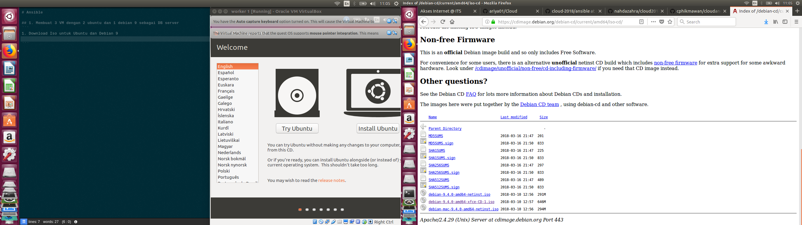
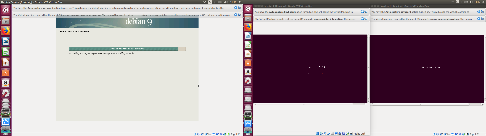
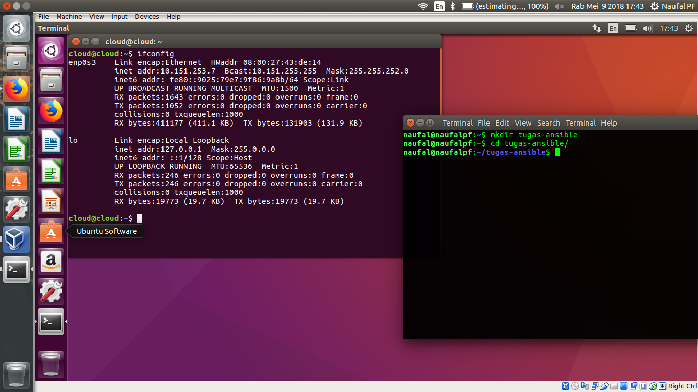
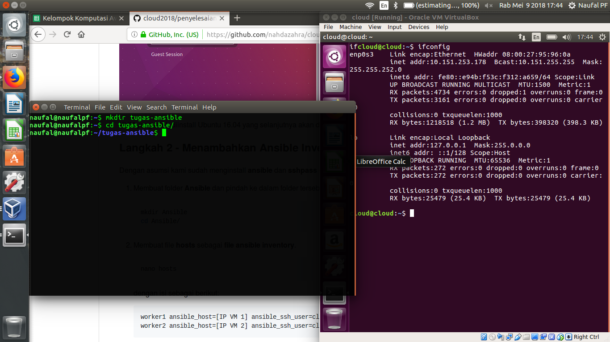
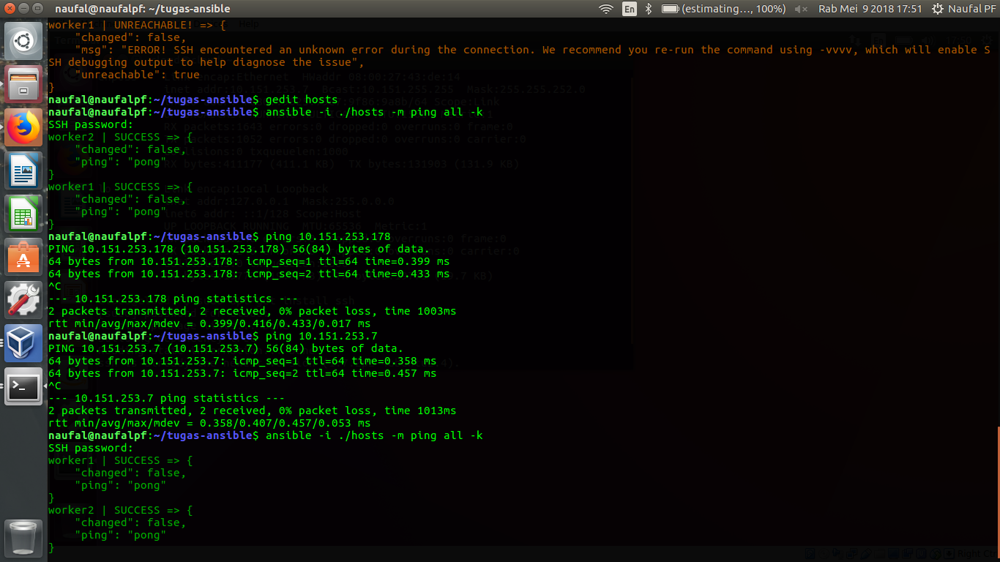
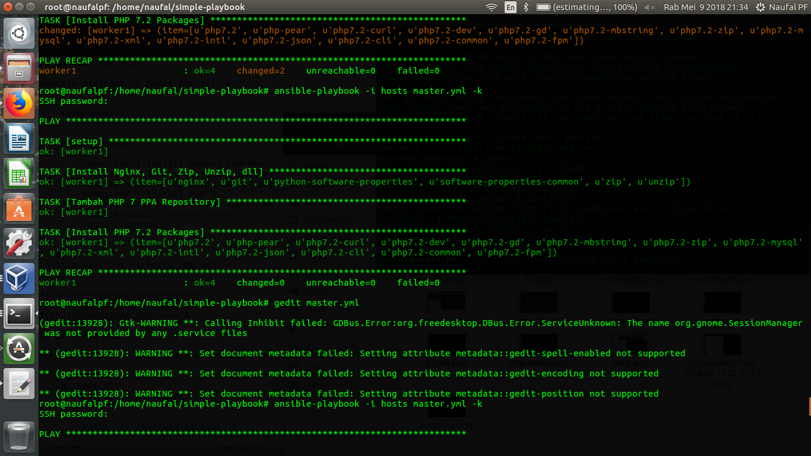
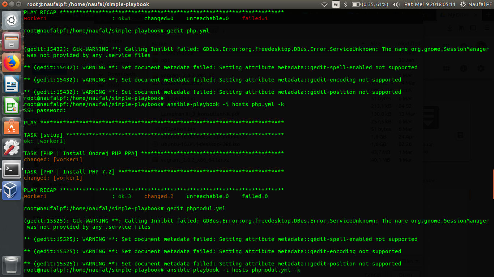

## Tugas Ansible

### Anggota Kelompok :

##### 1. Naufal Pranasetyo F.	5115100057
##### 2. Ariya Wildan Devanto	5115100123

## 1. Membuat 3 Virtual Machine
3 VM terdiri dari 2 VM Ubuntu 16.04 sebagai Worker dan 1 VM Debian 9 sebagai DB Server. 


Kami menggunakan Virtual Machine Manager untuk mengaturnya dan telah diinstall Ubuntu 16.04 yang selanjutnya akan digunakan sebagai worker.




## 2. Menambahkan Ansible Inventory


1. Membuat folder **Ansible**, lalu masuk pada folder tersebut

    ```bash
    mkdir Ansible
    cd Ansible/
    ```
2. Membuat file **hosts** pada folder Ansible
    ```
    nano hosts
    ```
    dengan isi sebagai berikut:

    ```
    worker1 ansible_host=[IP VM 1] ansible_ssh_user=cloud ansible_become_pass=raincloud123!
    worker2 ansible_host=[IP VM 2] ansible_ssh_user=cloud ansible_become_pass=raincloud123!
    ```
    
    **[IP VM 1]** dan **[IP VM 2]** diganti dengan IP masing-masing VM Worker.

    
	

    Sehingga, isi file ```hosts``` menjadi seperti ini:

    ```
    worker1 ansible_host=10.151.253.178 ansible_ssh_user=cloud ansible_become_pass=raincloud123!
    worker2 ansible_host=10.151.253.7 ansible_ssh_user=cloud ansible_become_pass=raincloud123!
    ```
3. ping VM.

    ```
    ansible -i ./hosts -m ping all -k
    ```
    Keterangan:
    * parameter **-i** : untuk men-declare ansible inventory.
    * parameter **-m** : untuk men-declare module command (dalam hal ini adalah command **ping**).
    * parameter **all** : untuk penanda ansible dijalankan di host mana. Parameter **all** bisa diganti dengan nama host.
    * parameter **-k** : untuk menanyakan password login ssh.

    


## 3. Melakukan grouping host

Membuka file ```hosts``` dan menambahkan nama group dalam tanda **[ ]**. Dalam hal ini, kami memberi nama group **worker**.

```
[worker]
worker1 ansible_host=10.151.253.178 ansible_ssh_user=cloud ansible_become_pass=raincloud123!
worker2 ansible_host=10.151.253.7 ansible_ssh_user=cloud ansible_become_pass=raincloud123!
```

## 4. Install menggunakan yml

Software yang dibutuhkan untuk menjalankan Aplikasi Laravel 5.6 adalah:

    * Nginx
    * PHP 7.2
    * Composer
    * Git

Seluruh software tersebut akan diinstall pada hosts **worker** menggunakan file **yml**. Dalam dunia per-ansible-an, kita menyebutnya sebagai **playbook**.

1. Membuat playbook baru bernama **master.yml**.

    ```
    gedit master.yml
    ```
2. Menuliskan script berikut:
```
  - hosts: worker
    tasks:
      - name: Install git-nginx-curl
        become: yes #untuk menjadi superuser
        apt: name={{ item }} state=latest update_cache=true
        with_items:
          - nginx
          - git
          - curl

```
```sh

3. Install PHP 7.2

ansible-playbook -i hosts php.yml -k
```

    Keterangan:
    
 ```
  - hosts: worker
    tasks:
      - name: PHP | Install Ondrej PHP PPA
        become: yes #untuk menjadi superuser
        apt_repository: repo='ppa:ondrej/php' update_cache=yes
      - name: PHP | Install PHP 7.2
        become: yes #untuk menjadi superuser
        apt: pkg=php7.2 state=latest
        tags: ['common']

```
```sh
ansible-playbook -i hosts php.yml -k
```




	
## 5. Clone git

Membuka ```master.yml``` dan memasukkan script berikut:

```yml
    # CLONE GIT
    - name: Bikin direktori
      become: true
      file:
        path: "{{ /var/www/laravel }}"
        state: directory
        owner: "{{ cloud }}"
        group: "{{ cloud }}"
        recurse: yes

    - name: Clone git
      git:
        dest: "{{ /var/www/laravel }}"
        repo: https://github.com/udinIMM/Hackathon.git
        force: yes
```
	


## 6. Install Composer

1. Membuka ```compose.yml``` dan memasukkan script berikut:

    ```yml
        # INSTALL COMPOSER
        - name: Download Composer
          script: scripts/install_composer.sh

        - name: Setting composer jadi global
          become: true
          command: mv composer.phar /usr/local/bin/composer

        - name: Set permission composer
          become: true
          file:
            path: /usr/local/bin/composer
            mode: "a+x"

        - name: Install dependencies laravel
          composer:
            working_dir: "{{ /var/www/laravel/storage }}"
            no_dev: no
        
        # SETTING ENVIRONMENT
        - name: Bikin .env
          command: cp "{{ /var/www/laravel/storage }}/.env.example" "{{ /var/www/laravel/storage }}/.env"
        
        - name: php artisan key generate
          command: php "{{ /var/www/laravel/storage }}/artisan" key:generate

        - name: php artisan clear cache
          command: php "{{ /var/www/laravel/storage }}/artisan" cache:clear
        
        - name: set APP_DEBUG=false
          lineinfile: 
            dest: "{{ /var/www/laravel/storage }}/.env"
            regexp: '^APP_DEBUG='
            line: APP_DEBUG=false

        - name: set APP_ENV=production
          lineinfile: 
            dest: "{{ /var/www/laravel/storage }}/.env"
            regexp: '^APP_ENV='
            line: APP_ENV=production

        - name: Ganti permission cache directory
          file:
            path: "{{ /var/www/laravel/cache }}"
            state: directory
            mode: "a+x"

        - name: Ganti permission vendor directory
          command: chmod -R 777 "{{ /var/www/laravel/vendor }}"

        - name: Ganti permission storage directory
          command: chmod -R 777 "{{ /var/www/laravel/storage }}" 
    ```
 
2. Membuat file ```install_composer.sh``` dalam folder ```scripts```.

    ```bash
    mkdir scripts
    cd scripts/
    nano install_composer.sh
    ```
    dan isikan script berikut:
    
    ```bash
    #!/bin/sh

    EXPECTED_SIGNATURE=$(wget -q -O - https://composer.github.io/installer.sig)
    php -r "copy('https://getcomposer.org/installer', 'composer-setup.php');"
    ACTUAL_SIGNATURE=$(php -r "echo hash_file('SHA384', 'composer-setup.php');")

    if [ "$EXPECTED_SIGNATURE" != "$ACTUAL_SIGNATURE" ]
    then
        >&2 echo 'ERROR: Invalid installer signature'
        rm composer-setup.php
        exit 1
    fi

    php composer-setup.php --quiet
    RESULT=$?
    rm composer-setup.php
    exit $RESULT
    ```

## 7. Konfigurasi Nginx

1. Membuat file konfigurasi nginx bernama ```nginx.conf``` dalam folder ```templates```.

    ```bash
    mkdir templates
    cd templates/
    nano nginx.conf
    ```
    dan mengisikan config sebagai berikut

    ```nginx
    server {
        listen 80 default_server;
        listen [::]:80 default_server;
        
        root {{ /var/www/laravel/public }};

        index index.php;

        server_name {{ inventory_hostname }};

        location / {
            try_files $uri $uri/ =404;
        }

        location ~ \.php$ {
            try_files $uri /index.php =404;
            fastcgi_split_path_info ^(.+\.php)(/.+)$;
            fastcgi_pass unix:/var/run/php/php7.2-fpm.sock;
            fastcgi_index index.php;
            fastcgi_param SCRIPT_FILENAME $document_root$fastcgi_script_name;
            include fastcgi_params;
        }

        error_log /var/log/nginx/{{ worker1 }}_error.log;
        access_log /var/log/nginx/{{ worker1 }}_access.log;
    }
    ```

2. Kemudian membuka ```nginx.yml``` dan memasukkan script berikut:

    ```yml
        # CONFIG NGINX
        - name: Configure Nginx
          become: true
          template:
            src: templates/nginx.conf
            dest: "{{ nginx_conf_dir }}/sites-enabled/default"
          notify:
            - Restart nginx
            - Restart PHP-fpm
    ```

Membuka ```compose.yml``` dan memasukkan script berikut dibawah modul ```Hosts``` baris paling pertama.

```yml
vars:
    laravel_root_dir: /var/www/laravel
    laravel_web_dir: "{{ /var/www/laravel }}/public"
    laravel_cache_dir: "{{ /var/www/laravel }}/bootstrap/cache"
    laravel_vendor_dir: "{{ /var/www/laravel }}/vendor"
    laravel_storage_dir: "{{ /var/www/laravel }}/storage"
    nginx_conf_dir: /etc/nginx
```


## 8. Menyatukan Playbook


## Testing

1. Menjalankan perintah

    ```
    ansible-playbook -i hosts gitcurl.yml -k
    ```


2. Ketikkan alamat IP VM Worker di browser, yang dalam hal ini adalah ```10.151.253.23``` dan ```10.151.253.7```.


