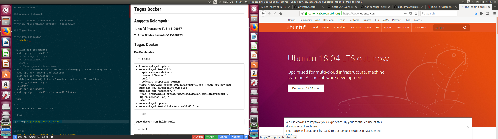

# Ansible

## 1. Membuat 3 VM dengan 2 ubuntu dan 1 debian 9 sebagai DB server
```
1. Download Iso untuk Ubuntu dan Debian 9
 - untuk debian 9
 
 - untuk ubuntu
 
2. Kemudian Install setiap iso
 
3. Setelah itu 3 Virtual box bisa digunakan