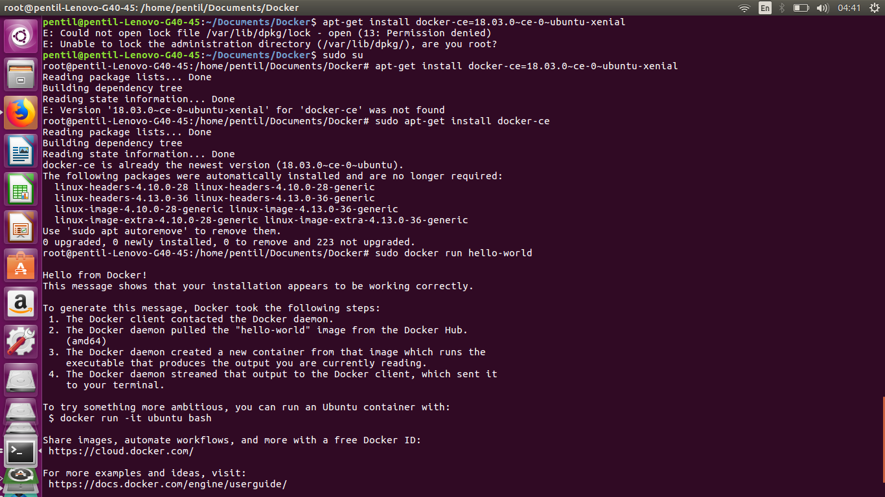

## Tugas Docker

### Anggota Kelompok :

##### 1. Naufal Pranasetyo F.	5115100057
##### 2. Ariya Wildan Devanto	5115100123

### Tugas Docker

##### Pra Pembuatan
- Instalasi 

```
- $ sudo apt-get update
- sudo apt-get install \
    apt-transport-https \
    ca-certificates \
    curl \
    software-properties-common
- https://download.docker.com/linux/ubuntu/gpg | sudo apt-key add -
- sudo apt-key fingerprint 0EBFCD88
- sudo add-apt-repository \
   "deb [arch=amd64] https://download.docker.com/linux/ubuntu \
   $(lsb_release -cs) \
   stable"
- sudo apt-get update
- sudo apt-get install docker-ce=18.03.0.ce
```
- Cek 

```
sudo docker run hello-world
```
- Hasil




##### No. 1
- Step 1 - Buat direktori baru untuk Docker
```
    mkdir Docker
```
- Step 2 - Buat **Dockerfile** dan edit untuk image soal 1
```
    nano Dockerfile
```
- Step 3 - Tulis ini pada **Dockerfile**
```
    FROM ubuntu:16.04

    RUN apt-get update -y
    RUN apt-get install -y wget zip
    RUN apt-get install -y python python-pip libmysqlclient-dev python-dev
    RUN pip install --upgrade pip

    RUN wget https://cloud.fathoniadi.my.id/reservasi.zip && unzip reservasi.zip

    WORKDIR reservasi
    RUN pip install -r req.txt
    ENTRYPOINT [ "python" ]
    CMD [ "server.py" ]

    EXPOSE 80
```
- Step 4 - Buat image pada docker
```
    docker build -t reserve ./
```


##### No. 2 
- Step 1 - Buat dan edit **docker-compose.yml**
```
    nano docker-compose.yml
```

```
 version: '3.3'

services:
    db:
        image: mysql:5.7
        restart: always
        environment:
            MYSQL_ROOT_PASSWORD: buayakecil
            MYSQL_DATABASE: reservasi
            MYSQL_USER: userawan
            MYSQL_PASSWORD: buayakecil
        volumes:
            - ./reservasi:/docker-entrypoint-initdb.d
            - dbdata:/var/lib/mysql
        networks:
            ip-docker:
                ipv4_address: 60.151.5.5

    worker1:
        image: reserve
        depends_on:
            - db
        restart: always
        environment: 
            DB_HOST: db
            DB_USERNAME: userawan
            DB_PASSWORD: buayakecil
            DB_NAME: reservasi
        networks:
            ip-docker:
                ipv4_address: 60.151.5.10

    worker2:
        image: reserve
        depends_on:
            - db
        restart: always
        environment: 
            DB_HOST: db
            DB_USERNAME: userawan
            DB_PASSWORD: buayakecil
            DB_NAME: reservasi
        networks:
            ip-docker:
                ipv4_address: 60.151.5.11

    worker3:
        image: reserve
        depends_on:
            - db
        restart: always
        environment:
            DB_HOST: db
            DB_USERNAME: userawan
            DB_PASSWORD: buayakecil
            DB_NAME: reservasi
        networks:
            ip-docker:
                ipv4_address: 60.151.5.12

    load-balancer:
        image: nginx:stable-alpine
        depends_on:
            - worker1
            - worker2
            - worker3
        volumes:
            - ./nginx.conf:/etc/nginx/conf.d/default.conf:ro
        ports:
            - 1234:80
        networks: 
            ip-docker:
                ipv4_address: 60.151.5.6

volumes:
    dbdata:

networks: 
    ip-docker:
        driver: bridge
        ipam: 
            config:
                - subnet: 60.151.5.0/24
```


- **Keterangan :**
##### Nomer 2
1. Worker - Menggunakan Image pada soal nomer 1
2. Worker - Pada untuk mengerjakan soal nomer 2 akan menggunakan docker-compose load balancing

##### Nomer 3
1. Nginx - Menggunakan image container dari Docker Hub -> nginx:stable-alpine
2. Nginx - untuk nginx.conf akan disimpan pada **/etc/nginx/conf.d/default.conf:ro** di container

- Konfigurasi untuk **nginx.conf** sebagai berikut :
```
    upstream worker {
    server 60.151.5.10;
    server 60.151.5.11;
    server 60.151.5.12;
}

    server {
        listen  80 default_server;
        location / {
            proxy_pass http://worker:80;
        }
    }
```
4. Jalan kan 
```
docker-compose up -d
```
##### Nomer 4
- Tampilan Website ketika mengakses ***localhost:1234***


##### Kesulitan 
1. kurangnya akses super user

2. Belum membuat nginx.conf

3. Karena ter cache maka harus di hapus terlebih dahulu ***docker volume rm -f dockerku_dbdata***
